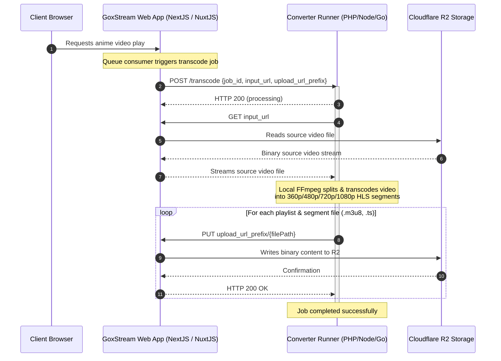

# Goxstream HLS Converter Workspace

This workspace houses the collection of video transcoding runners for the Goxstream anime streaming platform.

The Goxstream HLS Converter system operates on a Decoupled Factory Architecture. Rather than binding individual runner runtimes directly to storage credentials or DNS resolutions, all runners act as pure computing factories. They receive transcoding instructions, download inputs, and upload outputs entirely via standard HTTP requests directed at generic URLs proxied by the Goxstream Web Application (NextJS / NuxtJS).

---

## Communication Architecture

The sequence diagram below illustrates how the Goxstream web application brokers all R2 storage interactions, exposing download/upload proxies to keep the transcoder runners storage-agnostic.



---

## Decoupled API Contract

All transcoder runners conform to a single unified payload interface.

### 1. Initiate Transcoding Job
* **Endpoint**: `POST /transcode`
* **Content-Type**: `application/json`
* **Request Payload**:
  ```json
  {
    "job_id": "episode-12345",
    "input_url": "http://localhost:3000/api/internal/media/download?key=raw/source.mp4",
    "upload_url_prefix": "http://localhost:3000/api/internal/media/upload/streams/12345"
  }
  ```
* **Response Payload**:
  ```json
  {
    "status": "processing",
    "job_id": "episode-12345"
  }
  ```

### 2. File Download
* Run via a standard `GET` request to the provided `input_url`.

### 3. File Upload
* Run via a standard `PUT` request to `{upload_url_prefix}/{relPath}` where `{relPath}` represents the local relative file path (e.g. `master.m3u8`, `1080p/play.m3u8`, `1080p/segment_000.ts`).
* Appropriate `Content-Type` headers should be sent:
  * `.m3u8` -> `application/x-mpegURL`
  * `.ts` -> `video/MP2T`
  * Others -> `application/octet-stream`

---

## Workspace Packages (Runners)

The workspace supports multiple runner environments depending on resource availability and deployment preferences:

* **[packages/cf-container](./packages/cf-container/README.md)**:
  Cloudflare Workers Containers-based worker launcher. It receives triggers from queues and dispatches requests to individual container instances.
* **[packages/php-laravel](./packages/php-laravel/README.md)**:
  Laravel 13 Framework runner with built-in Artisan commands, Pest test suites, and Reverb websocket broadcasting.
* **[packages/php-native](./packages/php-native/README.md)**:
  Lightweight native PHP runner with a built-in HTTP server router and CLI background process runner.
* **[packages/node-native](./packages/node-native/README.md)**:
  TypeScript Node.js runner using native HTTP/HTTPS modules for download/upload streaming and a built-in WebSocket gateway.
* **[packages/go-native](./packages/go-native/README.md)**:
  Go-based high-performance runner using native net/http packages and concurrent goroutines.
* **[packages/docker-native](./packages/docker-native/README.md)**:
  Dockerized environment wrapping local transcoder runtime scripts.

---

## Workspace Management CLI (`ghc`)

A unified developer-friendly command-line tool `ghc` is available at the workspace root to orchestrate compiling, checks, and local development execution.

* **Check System Requirements**:
  ```bash
  ./ghc check
  ```
* **Install Dependencies**:
  ```bash
  ./ghc install
  ```
* **Launch Local Runner in Dev Mode**:
  ```bash
  ./ghc dev [go-native | node-native | php-native | php-laravel | cf-container | docker-native]
  ```

For more details on CLI operations, refer to the [scripts README](./scripts/README.md).
